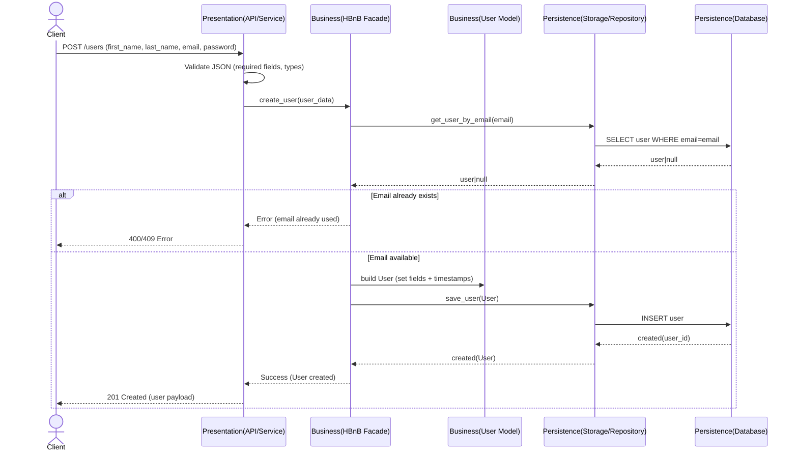
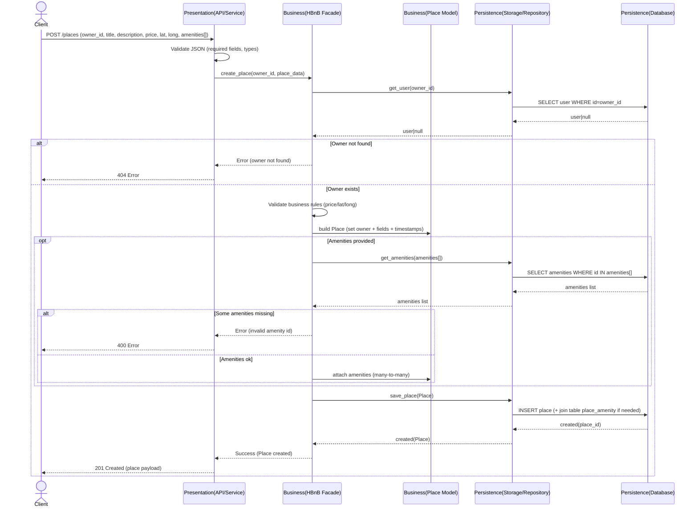
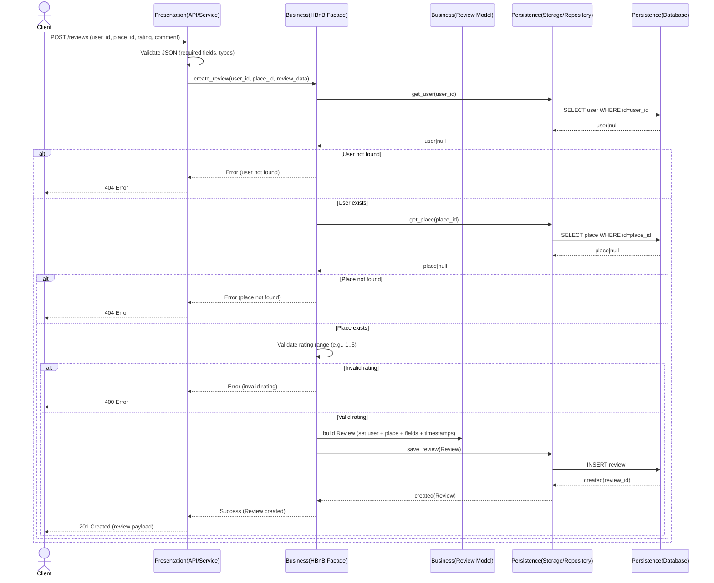
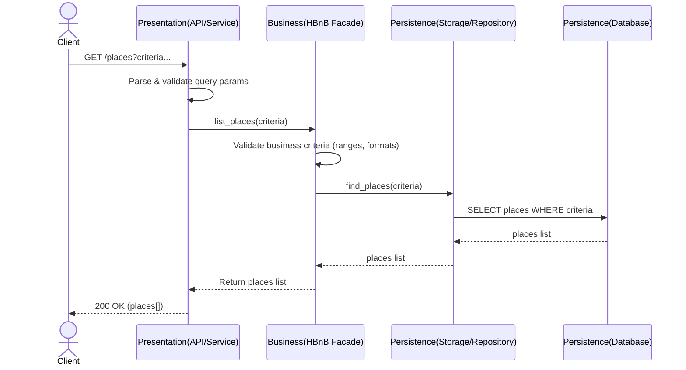

# 1 User Registration

```mermaid
sequenceDiagram
    actor Client
    participant API as Presentation(API/Service)
    participant Facade as Business(HBnB Facade)
    participant UserModel as Business(User Model)
    participant Store as Persistence(Storage/Repository)
    participant DB as Persistence(Database)

    Client->>API: POST /users (first_name, last_name, email, password)
    API->>API: Validate JSON (required fields, types)
    API->>Facade: create_user(user_data)

    Facade->>Store: get_user_by_email(email)
    Store->>DB: SELECT user WHERE email=email
    DB-->>Store: user|null
    Store-->>Facade: user|null

    alt Email already exists
        Facade-->>API: Error (email already used)
        API-->>Client: 400/409 Error
    else Email available
        Facade->>UserModel: build User (set fields + timestamps)
        Facade->>Store: save_user(User)
        Store->>DB: INSERT user
        DB-->>Store: created(user_id)
        Store-->>Facade: created(User)

        Facade-->>API: Success (User created)
        API-->>Client: 201 Created (user payload)
    end
```

# 2 Place Creation

```mermaid
sequenceDiagram
    actor Client
    participant API as Presentation(API/Service)
    participant Facade as Business(HBnB Facade)
    participant PlaceModel as Business(Place Model)
    participant Store as Persistence(Storage/Repository)
    participant DB as Persistence(Database)

    Client->>API: POST /places (owner_id, title, description, price, lat, long, amenities[])
    API->>API: Validate JSON (required fields, types)
    API->>Facade: create_place(owner_id, place_data)

    Facade->>Store: get_user(owner_id)
    Store->>DB: SELECT user WHERE id=owner_id
    DB-->>Store: user|null
    Store-->>Facade: user|null

    alt Owner not found
        Facade-->>API: Error (owner not found)
        API-->>Client: 404 Error
    else Owner exists
        Facade->>Facade: Validate business rules (price/lat/long)
        Facade->>PlaceModel: build Place (set owner + fields + timestamps)

        opt Amenities provided
            Facade->>Store: get_amenities(amenities[])
            Store->>DB: SELECT amenities WHERE id IN amenities[]
            DB-->>Store: amenities list
            Store-->>Facade: amenities list

            alt Some amenities missing
                Facade-->>API: Error (invalid amenity id)
                API-->>Client: 400 Error
            else Amenities ok
                Facade->>PlaceModel: attach amenities (many-to-many)
            end
        end

        Facade->>Store: save_place(Place)
        Store->>DB: INSERT place (+ join table place_amenity if needed)
        DB-->>Store: created(place_id)
        Store-->>Facade: created(Place)

        Facade-->>API: Success (Place created)
        API-->>Client: 201 Created (place payload)
    end
```

# 3 Review submission

```mermaid
sequenceDiagram
    actor Client
    participant API as Presentation(API/Service)
    participant Facade as Business(HBnB Facade)
    participant ReviewModel as Business(Review Model)
    participant Store as Persistence(Storage/Repository)
    participant DB as Persistence(Database)

    Client->>API: POST /reviews (user_id, place_id, rating, comment)
    API->>API: Validate JSON (required fields, types)
    API->>Facade: create_review(user_id, place_id, review_data)

    Facade->>Store: get_user(user_id)
    Store->>DB: SELECT user WHERE id=user_id
    DB-->>Store: user|null
    Store-->>Facade: user|null

    alt User not found
        Facade-->>API: Error (user not found)
        API-->>Client: 404 Error
    else User exists
        Facade->>Store: get_place(place_id)
        Store->>DB: SELECT place WHERE id=place_id
        DB-->>Store: place|null
        Store-->>Facade: place|null

        alt Place not found
            Facade-->>API: Error (place not found)
            API-->>Client: 404 Error
        else Place exists
            Facade->>Facade: Validate rating range (e.g., 1..5)
            alt Invalid rating
                Facade-->>API: Error (invalid rating)
                API-->>Client: 400 Error
            else Valid rating
                Facade->>ReviewModel: build Review (set user + place + fields + timestamps)
                Facade->>Store: save_review(Review)
                Store->>DB: INSERT review
                DB-->>Store: created(review_id)
                Store-->>Facade: created(Review)

                Facade-->>API: Success (Review created)
                API-->>Client: 201 Created (review payload)
            end
        end
    end
```

# 4 Fetching List of Places

```mermaid
sequenceDiagram
    actor Client
    participant API as Presentation(API/Service)
    participant Facade as Business(HBnB Facade)
    participant Store as Persistence(Storage/Repository)
    participant DB as Persistence(Database)

    Client->>API: GET /places?criteria...
    API->>API: Parse & validate query params
    API->>Facade: list_places(criteria)

    Facade->>Facade: Validate business criteria (ranges, formats)
    Facade->>Store: find_places(criteria)
    Store->>DB: SELECT places WHERE criteria
    DB-->>Store: places list
    Store-->>Facade: places list

    Facade-->>API: Return places list
    API-->>Client: 200 OK (places[])
```